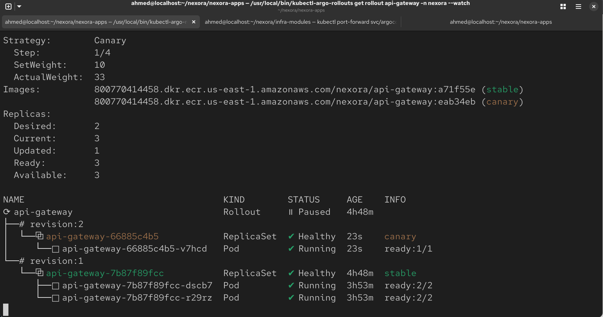
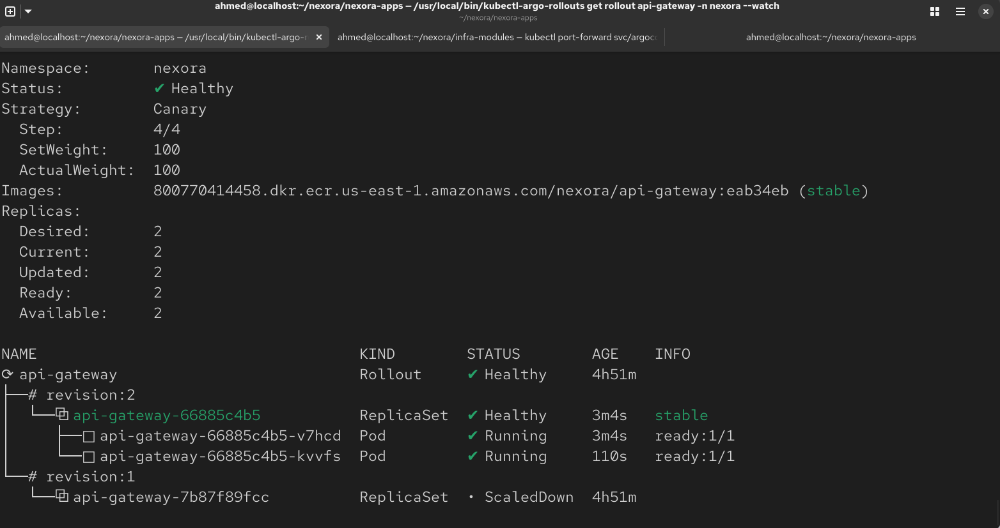
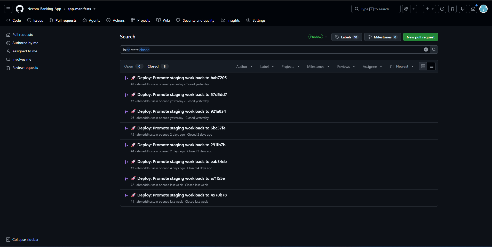

***

<div align="center">

# Nexora Core Banking: Application Manifests (`app-manifests`)

### Multi-Environment Overlays, Gateway API Routing, and Progressive Delivery

**Kustomize • Kubernetes Gateway API • Argo Rollouts • External Secrets Operator • Amazon ECR**

<br>


<br>

This repository is the **Deployment Target** for the Nexora Enterprise Platform. Structured via Kustomize (`base/` and `overlays/`), it contains the environment-specific declarative configurations for all core banking workloads across Staging and Production clusters. It serves as the single source of truth for application versions and is the direct target of the automated CI promotion bot.

</div>

---

## Table of Contents

1. [Architectural Philosophy](#architectural-philosophy)
2. [Directory Structure](#directory-structure)
3. [The Kustomize Inheritance Model](#the-kustomize-inheritance-model)
4. [Environment Overlay Specifications](#environment-overlay-specifications)
5. [Ingress & Gateway API Architecture](#ingress--gateway-api-architecture)
6. [Progressive Delivery (Argo Rollouts)](#progressive-delivery-argo-rollouts)
7. [The GitOps Promotion Flow](#the-gitops-promotion-flow)
8. [Real-World Troubleshooting & Solutions](#real-world-troubleshooting--solutions)
9. [Known Gaps & Open Items](#known-gaps--open-items)

---

## Architectural Philosophy

In this platform, **application source code is strictly separated from deployment configuration**. 

Developers commit Python code in `nexora-apps`. This repository (`app-manifests`) contains zero application logic—it contains only the declarative specifications of how those containers run in Kubernetes. 

By utilizing Kustomize overlays, we maintain a single, unpolluted `base/` configuration while allowing environment-specific modifications (like staging resource quotas, production high availability scaling, and AWS ECR digest pinning) to be layered on top without template duplication.

---

## Directory Structure

```text
app-manifests/
├── base/                               <-- Environment-Agnostic Workload Blueprints
│   ├── kustomization.yaml              <-- Aggregates all base resources
│   ├── frontend.yaml                   <-- NGINX Single-Page Application (Deployment & Service)
│   ├── api-gateway.yaml                <-- Edge Gateway (Argo Rollout & Service)
│   ├── auth-service.yaml               <-- Identity & Bcrypt Service (Deployment & Service)
│   ├── account-service.yaml            <-- Read-Only CQRS Ledger (Deployment & Service)
│   ├── transaction-service.yaml        <-- ACID Financial Mutation Engine (Deployment & Service)
│   └── fraud-service.yaml              <-- CPU Risk Engine & HorizontalPodAutoscaler (HPA)
│
└── overlays/
    ├── staging/                        <-- Staging Environment Target (nexora-staging cluster)
    │   ├── kustomization.yaml          <-- Injects Amazon ECR image digests & patches
    │   ├── external-secret.yaml        <-- Binds to nexora/staging/db-credentials via ESO
    │   ├── gateway.yaml                <-- Kubernetes Gateway API (Gateway & HTTPRoute)
    │   └── db-init-job.yaml            <-- Automated MySQL DDL & Staging Treasury Seeding
    │
    └── prod/                           <-- Production Environment Target (nexora-prod cluster)
        ├── kustomization.yaml          <-- Enforces replicas: 2 across AZs & production quotas
        ├── external-secret.yaml        <-- Binds to nexora/prod/db-credentials (Multi-AZ RDS)
        ├── gateway.yaml                <-- Production Kubernetes Gateway API load balancer
        └── db-init-job.yaml            <-- Production MySQL DDL & $10M Treasury Seeding
```

---

## The Kustomize Inheritance Model

The repository uses Kustomize's declarative patching engine:

```text
[ base/ (Canonical Workload Definitions) ]
                   │
         ┌─────────┴─────────┐
         ▼                   ▼
[ overlays/staging/ ]     [ overlays/prod/ ]
  • Cost-optimized sizing   • High Availability (replicas: 2)
  • Staging ECR digests     • Production ECR digests
  • Staging RDS secrets     • Multi-AZ RDS secrets (RPO=0)
  • Staging Gateway API     • Production Gateway API
```

---

## Environment Overlay Specifications

| Feature | Staging Overlay (`overlays/staging/`) | Production Overlay (`overlays/prod/`) |
| :--- | :--- | :--- |
| **Target Cluster** | `nexora-staging` EKS cluster | `nexora-prod` EKS cluster |
| **Replica Strategy** | `replicas: 1` (Conserves staging compute) | **`replicas: 2`** (Patched via Kustomize RFC 6902) |
| **High Availability** | Single node placement acceptable | **Multi-AZ Spread:** Pods distributed across AZs |
| **Secrets Manager Path** | `nexora/staging/db-credentials` | **`nexora/prod/db-credentials`** |
| **Database Target** | Single-AZ RDS MySQL (`db.t3.micro`) | **Multi-AZ Synchronous RDS MySQL (`db.t3.medium`, RPO=0)** |
| **Autoscaling Target** | HPA: `fraud-service` (1-5 pods) | HPA: `fraud-service` (1-5 pods) |

---

## Ingress & Gateway API Architecture

This repository adopts the modern **Kubernetes Gateway API (`gateway.networking.k8s.io`)**, completely replacing legacy Kubernetes `Ingress`.

```text
[ Public Internet ] ──► [ AWS Load Balancer (Port 80) ]
                                   │
                                   ▼
             [ Kubernetes Gateway: nexora-gateway ]
                                   │
         ┌─────────────────────────┴─────────────────────────┐
         │ Matches PathPrefix: /                             │ Matches PathPrefix: /api/*
         ▼                                                   ▼
[ Service: frontend-web:80 ]                         [ Service: api-gateway:8000 ]
```

### 1. `Gateway` Resource
Declared in `overlays/{env}/gateway.yaml` with `gatewayClassName: istio`. 
* Carries the annotation `service.beta.kubernetes.io/aws-load-balancer-scheme: "internet-facing"`, instructing AWS to provision a public Load Balancer.

### 2. `HTTPRoute` Resource
Defines layer-7 path routing rules on a single domain and port:
* **`/api/*`** routes to `api-gateway` on port 8000.
* **`/`** routes to `frontend-web` on port 80.
* **Zero CORS:** Because the SPA frontend and the backend API are served from the identical Load Balancer hostname on port 80, the browser does not enforce cross-origin restrictions, allowing the frontend to call `/api` using relative paths.

---

## Progressive Delivery (Argo Rollouts)

In `base/api-gateway.yaml`, the standard Kubernetes `Deployment` is replaced with an **Argo Rollout**:

```yaml
spec:
  strategy:
    canary:
      steps:
        - setWeight: 10   # Route 10% of traffic to the new version
        - pause: 
            duration: 30s # 30-second observation window
        - setWeight: 50   # Ramp up to 50%
        - pause: 
            duration: 30s
        # Automatically promotes to 100% if no errors occur
```

When an image digest update is merged, Argo Rollouts creates a new Canary ReplicaSet, splits live traffic 10/90, and pauses before full promotion, preventing bad builds from causing 100% user-facing outages.



---

## The GitOps Promotion Flow

This repository is mutated automatically by our CI supply chain pipeline:

```text
1. Developer pushes code to nexora-apps repository.
2. GitHub Actions runs Trivy CVE scan and Cosign image signing.
3. CI builds and pushes immutable image: <AWS_ACCOUNT_ID>.dkr.ecr.us-east-1.amazonaws.com/nexora/<service>:<GIT_SHA>.
4. The CI bot opens an automated Pull Request in this repository (app-manifests).
5. The PR updates overlays/staging/kustomization.yaml to point to the new <GIT_SHA>.
6. An engineer reviews and merges the PR.
7. ArgoCD detects the merge and initiates the progressive canary rollout on the cluster.
8. Promotion to Production: A secondary PR promotes the verified <GIT_SHA> from staging into overlays/prod/.
```



---

## Real-World Troubleshooting & Solutions

### 1. Database Init Job Failed with Syntax Error 1064 (Here-Doc Failure)
* **Symptom:** `nexora-db-init-job` crashed with `ERROR 1064 (42000): You have an error in your SQL syntax` and a bash warning `here-document at line 3 delimited by end-of-file (wanted 'EOF')`.
* **Diagnosis:** In bash, `<<'EOF'` requires the closing delimiter to have zero leading spaces. Because YAML requires indentation, bash saw spaces in front of `EOF`, failed to find the end of the script, and sent truncated, broken SQL to MySQL.
* **Fix:** Replaced the fragile `<<'EOF'` here-document with the direct `mysql -h ... -e "..."` command flag, which executes cleanly regardless of YAML indentation.

### 2. Job.spec.template Immutable Field Error
* **Symptom:** ArgoCD sync failed with `Job.batch "nexora-db-init-job" is invalid: spec.template: field is immutable`.
* **Diagnosis:** In Kubernetes, a Job's pod template cannot be modified in-place once created. When changes were committed to the job, ArgoCD attempted to patch the existing live job, which was rejected by the Kubernetes API.
* **Fix:** Injected ArgoCD hook annotations: `argocd.argoproj.io/hook: Sync` and `argocd.argoproj.io/hook-delete-policy: BeforeHookCreation`. ArgoCD now automatically deletes the old job before creating the new one on every sync.

### 3. Missing Secret "platform-secrets"
* **Symptom:** `transaction-service` crashed on startup with `Error: secret "platform-secrets" not found`.
* **Diagnosis:** When hardcoded secrets were purged from Git in Phase 3, the deployment was still referencing the old secret name (`platform-secrets`) instead of the unified dynamic secret (`db-secret`) generated by ESO.
* **Fix:** Updated all microservice manifests in `base/*.yaml` to consume environment variables exclusively via `envFrom: - secretRef: name: db-secret`.

### 4. Pod Limit Exceeded on t3.micro Nodes
* **Symptom:** Pods were stuck in `Pending` with `0/2 nodes are available: 2 Too many pods`.
* **Diagnosis:** On AWS EKS, `t3.micro` instances have an architectural limit of 4 pods per node due to ENI IP constraints. Running 2 replicas of every service exhausted the 8 available slots.
* **Fix:** Sized staging base workloads conservatively, and subsequently resized the underlying node group to `c7i-flex.large` (58 pod slots) to allow unconstrained execution.

---

## Known Gaps & Open Items

* **Gateway API TLS Termination:** The `Gateway` resource currently listens on raw HTTP (port 80). In a full production banking deployment, an AWS Certificate Manager (ACM) SSL certificate should be bound to the Gateway on port 443 with an HTTP-to-HTTPS redirect rule.